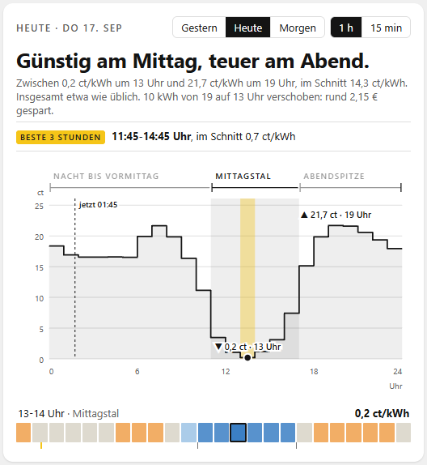
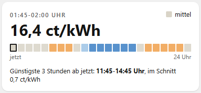
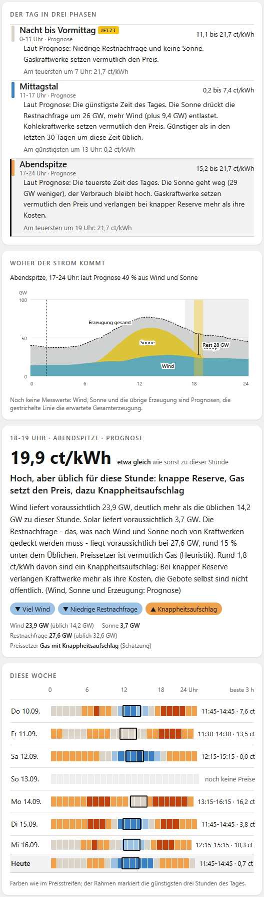
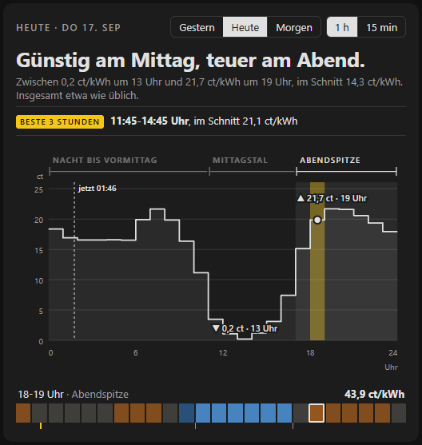

# Strompreis verstehen für Home Assistant

Der Börsenstrompreis für Deutschland in Home Assistant, Viertelstunde für Viertelstunde, und dazu die Erklärung, warum er gerade so hoch oder niedrig ist. Die Daten kommen von [strompreis-verstehen.de](https://strompreis-verstehen.de), die Rohdaten von der Bundesnetzagentur (SMARD).

Die Integration liefert Sensoren für Automationen (aktueller Preis, Preisstufe, die günstigsten drei Stunden, der eigene Endpreis für das Energie-Dashboard) und bringt die Karten der Website als Dashboard-Karten mit. Ein Konto oder API-Schlüssel ist nicht nötig.

English summary at the end.



## Voraussetzungen

Home Assistant 2026.3 oder neuer.

## Installation

Über HACS: HACS öffnen, oben rechts im Menü "Benutzerdefinierte Repositories" wählen, `https://github.com/ehrma/ha-strompreis-verstehen` mit dem Typ "Integration" eintragen und "Strompreis verstehen" installieren. Danach Home Assistant neu starten.

Von Hand: den Ordner `custom_components/strompreis_verstehen` aus dem neuesten Release nach `config/custom_components/` kopieren und Home Assistant neu starten.

Anschließend unter Einstellungen, Geräte & Dienste, Integration hinzufügen, nach "Strompreis verstehen" suchen. Die Einrichtung braucht keine Eingaben.

## Eigener Tarif

Über das Zahnrad am Eintrag der Integration lässt sich der eigene Tarif eintragen. Daraus rechnet der Sensor "Mein Preis" den Endpreis je Viertelstunde.

Beim dynamischen Tarif ist der Aufschlag alles, was zum Börsenpreis dazukommt (Netzentgelt, Steuern, Umlagen, Anbieter), brutto in ct/kWh, so wie er meist auf dem Preisblatt steht. Die Mehrwertsteuer wird nur auf den Börsenpreis gerechnet. Beispiel: 17,5 ct Börsenpreis, 19 % und 20,3 ct Aufschlag ergeben 17,5 × 1,19 + 20,3 = 41,1 ct/kWh.

Beim Tarif mit festen Zeiten (HT/NT) gilt der eingetragene Arbeitspreis, der Börsenpreis spielt dann keine Rolle. Unter "Zeitfenster" lassen sich bis zu drei Zeiten mit eigenem Preis eintragen, etwa ein Zeitfenster nach §14a oder der Nachtstrom. Ein Fenster von 22 bis 6 Uhr geht über Mitternacht.

Ohne eingetragenen Tarif rechnet "Mein Preis" mit den Standardwerten der Website (19,69 ct Aufschlag, 19 %). Welche Preise in den Karten dem eigenen Tarif folgen und welche beim Börsenpreis bleiben, steht auf der Website unter [So rechnet Mein Preis](https://strompreis-verstehen.de/so-rechnet-mein-preis): mit `unit: mein_preis` zeigen die Karten jeden Preis als Endpreis, nur die Farben der Preisstufen und die Marktbeträge in den Erklärungen bleiben beim Börsenpreis.

## Entitäten

Die Entity-IDs folgen der Sprache der Home-Assistant-Installation. Hier die Namen einer deutschen Installation.

| Entität | Inhalt |
| --- | --- |
| `sensor.strompreis_verstehen_borsenpreis` | Börsenpreis der laufenden Viertelstunde in ct/kWh. Im Attribut `data` stehen alle Viertelstunden von heute und morgen in €/kWh, im selben Format wie bei der EPEX-Spot-Integration, sodass Karten wie price-timeline-card oder apexcharts-card damit arbeiten. |
| `sensor.strompreis_verstehen_mein_preis` | Endpreis mit dem eigenen Tarif in €/kWh. Diesen Sensor im Energie-Dashboard als Strompreis wählen. |
| `sensor.strompreis_verstehen_borsenpreis_nachste_viertelstunde` | Börsenpreis der nächsten Viertelstunde |
| `sensor.strompreis_verstehen_preisstufe` | negativ, sehr günstig, günstig, mittel, teuer, sehr teuer (feste Grenzen bei 0, 8, 13, 18 und 23 ct/kWh) |
| `sensor.strompreis_verstehen_heute_durchschnitt`, `..._heute_tiefstpreis`, `..._heute_hochstpreis` | Tageswerte, Tief- und Höchstpreis mit Uhrzeit im Attribut |
| `sensor.strompreis_verstehen_morgen_durchschnitt` | ab etwa 13 Uhr, wenn die Preise für morgen feststehen |
| `sensor.strompreis_verstehen_gunstigste_3_stunden` | Beginn der günstigsten drei Stunden, die noch nicht vorbei sind, Ende und Durchschnitt im Attribut. Ein laufendes Fenster bleibt stehen, bis es endet. |
| `sensor.strompreis_verstehen_tagesphase` | Name der Tagesphase mit Erklärtext |
| `sensor.strompreis_verstehen_erklarung` | Überschrift der Erklärung für die laufende Stunde, der ganze Text und die Einflussfaktoren im Attribut |
| `sensor.strompreis_verstehen_tagesbild` | Zusammenfassung des Tages |
| `sensor.strompreis_verstehen_preissetzer` | geschätzter Preissetzer (Überschuss, Erneuerbare, Kohle, Gas, Knappheit) |
| `sensor.strompreis_verstehen_anteil_wind_sonne_bio` | Anteil erneuerbarer Erzeugung am Verbrauch in Prozent |
| `binary_sensor.strompreis_verstehen_negativer_preis` | an, solange der Börsenpreis unter null liegt |
| `binary_sensor.strompreis_verstehen_in_den_gunstigsten_3_stunden` | an während der günstigsten drei Stunden |
| `binary_sensor.strompreis_verstehen_preise_fur_morgen_da` | an, sobald die Preise für morgen veröffentlicht sind |

Die Integration fragt alle 15 Minuten ab, nach der Auktion gegen 13 Uhr und abends, wenn die Erklärungen kommen, etwas häufiger. Der Wechsel zur nächsten Viertelstunde passiert ohne neue Abfrage.

## Aktionen

`strompreis_verstehen.find_cheapest_window` sucht die günstigste zusammenhängende Zeit einer bestimmten Dauer, wahlweise mit frühestem Start und spätestem Ende, nach Börsenpreis oder nach "Mein Preis". Die Antwort enthält `found`, `start`, `end`, den Durchschnitt und die einzelnen Viertelstunden.

`strompreis_verstehen.get_prices` gibt die Viertelstundenpreise von gestern, heute oder morgen zurück, jeweils Börsenpreis, eigener Preis und Preisstufe.

Beispiel: Die Spülmaschine soll in den günstigsten zweieinhalb Stunden bis sieben Uhr morgens laufen, sobald sie eingeräumt ist.

```yaml
alias: Spülmaschine zur günstigsten Zeit
triggers:
  - trigger: state
    entity_id: input_boolean.spuelmaschine_bereit
    to: "on"
actions:
  - action: strompreis_verstehen.find_cheapest_window
    data:
      duration: "02:30:00"
      latest_end: "{{ (today_at('07:00') + timedelta(days=1)).isoformat() }}"
      price: my_price
    response_variable: fenster
  - condition: template
    value_template: "{{ fenster.found }}"
  - delay:
      seconds: "{{ [0, (as_datetime(fenster.start) - now()).total_seconds()] | max | int }}"
  - action: switch.turn_on
    target:
      entity_id: switch.spuelmaschine
  - action: input_boolean.turn_off
    target:
      entity_id: input_boolean.spuelmaschine_bereit
```

Einfacher geht es mit dem Binärsensor, etwa für einen Heizstab, der in den günstigsten drei Stunden laufen darf:

```yaml
alias: Heizstab in den günstigsten Stunden
triggers:
  - trigger: state
    entity_id: binary_sensor.strompreis_verstehen_in_den_gunstigsten_3_stunden
actions:
  - action: "switch.turn_{{ trigger.to_state.state }}"
    target:
      entity_id: switch.heizstab
```

## Karten

Die Integration lädt ihre Karten selbst, eine zusätzliche Ressource ist nicht nötig. Nach der Installation oder einem Update einmal den Browser neu laden. Im Dashboard unter "Karte hinzufügen" nach "Strompreis" suchen.



Strompreis jetzt zeigt den Preis der laufenden Viertelstunde, die Preisstufe, den Rest des Tages als Streifen und die günstigsten drei Stunden ab jetzt.

Strompreis Tag ist der obere Teil der Tagesseite der Website: das Tagesbild, der Preisverlauf mit Phasen und der Preisstreifen, umschaltbar zwischen gestern, heute und morgen sowie zwischen Stunden und Viertelstunden.

Strompreis Phasen, Strompreis Woher der Strom kommt und Strompreis Stunde im Detail zeigen die Tagesphasen mit Text, die Erzeugung aus Wind, Sonne, Kohle und Gas mit Verbrauch und Restnachfrage, und die Erklärung einer einzelnen Stunde.

Strompreis Woche zeigt die letzten sieben Tage, heute und morgen, jeweils mit den günstigsten drei Stunden.



Die Karten auf einem Dashboard hängen zusammen: Wer im Preisverlauf eine Stunde antippt, sieht sie auch in den Phasen, in der Erzeugung und im Stundendetail. Jede Karte kann Preise als Börsenpreis in ct/kWh, als eigenen Preis oder in €/MWh zeigen.

```yaml
type: custom:strompreis-day-card
unit: mein_preis
```

Die Karten folgen dem hellen oder dunklen Design von Home Assistant. Hier die Tageskarte dunkel und mit dem eigenen Preis:



Die Karten sind derzeit nur auf Deutsch.

## Daten und Lizenz

Die Preise und Erzeugungsdaten stammen von der Bundesnetzagentur, SMARD.de, unter CC BY 4.0. strompreis-verstehen.de rechnet sie in Stunden und Phasen um und erzeugt die Erklärtexte heuristisch, sie sind keine Angabe der Bundesnetzagentur. Die Angaben sind ohne Gewähr.

Der Code dieser Integration steht unter der MIT-Lizenz.

## Entwicklung

Die Tests laufen mit `pytest-homeassistant-custom-component` unter Python 3.14:

```bash
pip install -r requirements_test.txt
pytest
```

Die Karten werden aus dem Quellcode der Website gebaut und als fertige Datei nach `custom_components/strompreis_verstehen/frontend/` kopiert (`scripts/build_cards.sh`). Ein Release entsteht mit `scripts/release.sh 0.2.0`: Version im Manifest setzen, Karten bauen, Commit und Tag anlegen.

## English summary

German day-ahead electricity prices in Home Assistant, per quarter hour, with an explanation of why the price is what it is, from [strompreis-verstehen.de](https://strompreis-verstehen.de). The integration needs no account. It provides sensors for automations (current price, price level, the cheapest three hours, your own end price in €/kWh for the Energy dashboard), two actions (`find_cheapest_window` and `get_prices`) and six dashboard cards that load automatically. Install it through HACS as a custom repository, add it under Settings, Devices & services, and enter your tariff through the gear icon. Entity names and the setup screens are translated into English; the cards and the explanation texts are German only.
